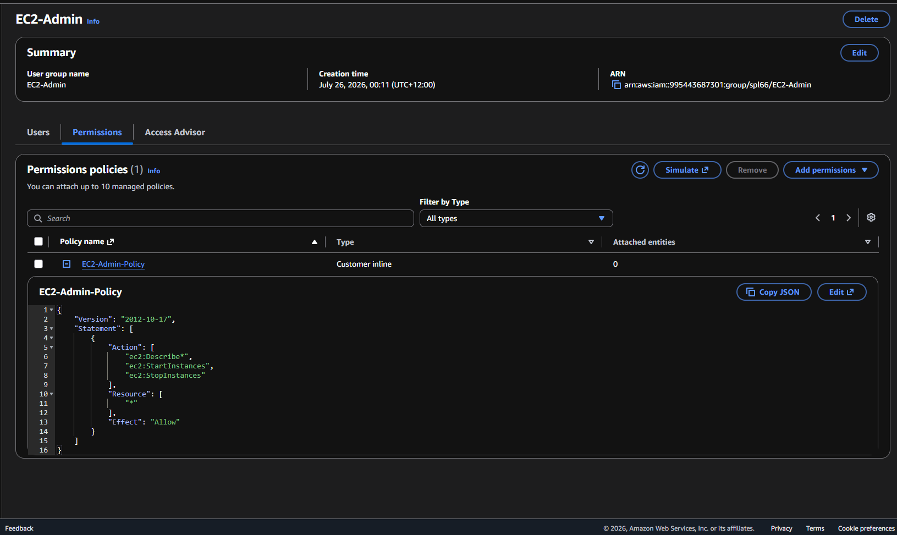
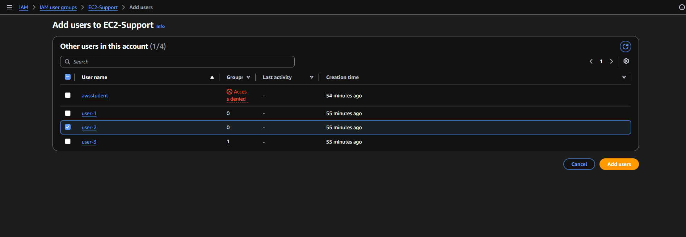
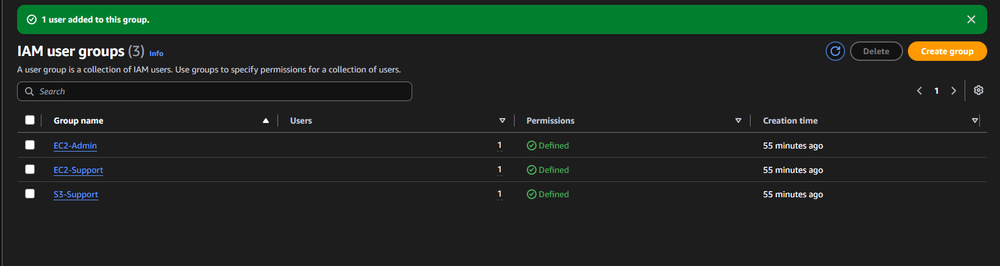
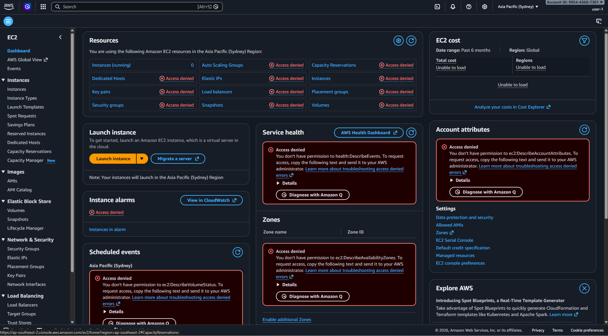
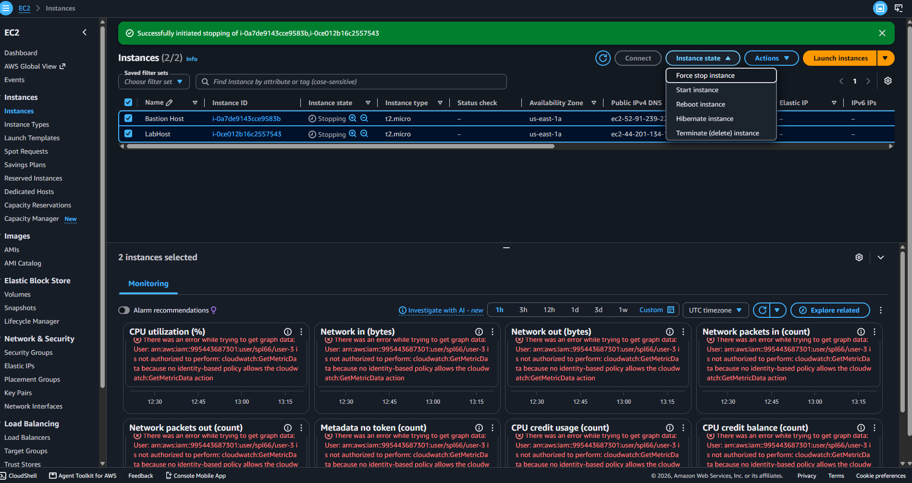

# Lab 1: Introduction to AWS IAM

Part of my AWS Academy Cloud Foundations coursework (Yoobee College, Diploma in Cloud Computing and Cyber Security).

## What this lab covers

This lab explores how AWS Identity and Access Management (IAM) controls who can log into an AWS account and what they're allowed to do once they're in. The lab used three pre-built users and three pre-built groups, each with different permission levels, to demonstrate how access control actually behaves in practice — not just in theory.

## What I did

**1. Explored existing users and groups**

Three groups already existed, each with a different type of access:
- `EC2-Support` — read-only access to EC2 (view instances, but can't start/stop/change anything)
- `S3-Support` — read-only access to S3 storage
- `EC2-Admin` — full start/stop control over EC2 instances, using a custom-written policy rather than one of AWS's pre-built ones

Inspecting the EC2-Admin group's policy directly (below) shows exactly what it grants — permission to describe, start, and stop any EC2 instance:

**2. Assigned each user to the group matching their job role**

Following a simple business scenario (new hires needing different levels of access depending on their role), I assigned:
- `user-1` → S3-Support
- `user-2` → EC2-Support
- `user-3` → EC2-Admin

Confirmed all three groups showed exactly one assigned user each:

**3. Tested the permissions actually worked — not just that they existed**

This was the most important part of the lab. Rather than trusting that a permission policy does what it says, I signed in as each user separately (using a private browser session) and tried real actions to confirm the access boundaries actually held up.

Signed in as `user-1` (S3-Support only) and tried to access EC2 — correctly blocked. The dashboard returned "Access denied" across every EC2 resource, confirming the read-only S3 permission doesn't leak into any EC2 access:

Signed in as `user-3` (EC2-Admin) and successfully stopped a running EC2 instance — confirming the admin-level policy's start/stop permission works as intended:

## What I learned

- **Permissions are deny-by-default.** A brand-new IAM user starts with zero access — nothing is assumed or inherited until a policy explicitly grants it.
- **Managed vs. custom policies serve different purposes.** AWS's pre-built policies (like `AmazonEC2ReadOnlyAccess`) are quick to apply and maintained by AWS, while a custom policy (like the one for EC2-Admin) is needed when you want a more specific, deliberately scoped set of permissions — in this case, view plus start/stop, but nothing broader.
- **Testing matters as much as configuring.** It's easy to attach a policy and assume it works. Actually logging in as each user and trying real actions is what confirms the access boundary is doing what you think it's doing — this is the difference between "I set up a permission" and "I verified a permission."
- **Groups make permission management scale.** Assigning permissions to a group once, then adding users to it, is far more maintainable than setting individual permissions per user — especially as an organization grows.
