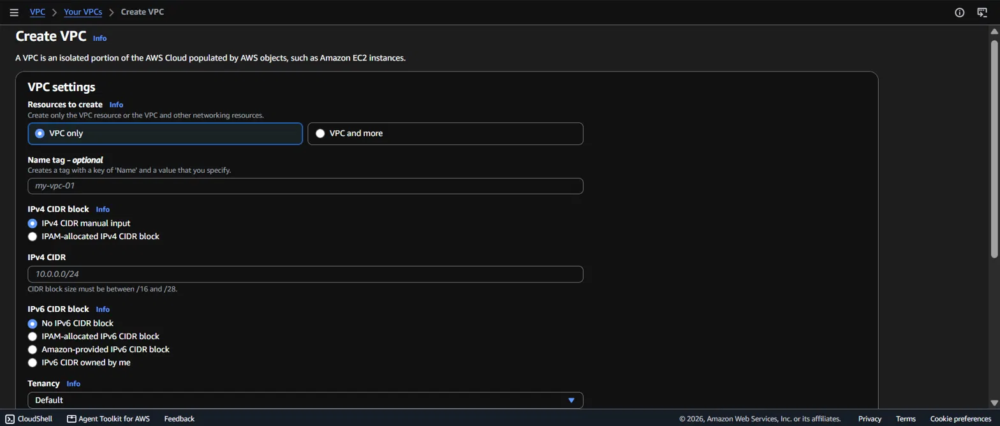
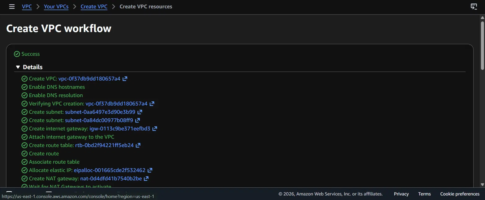
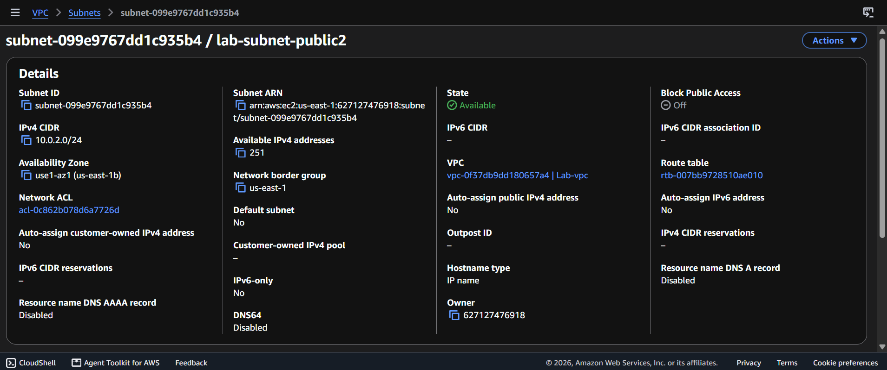
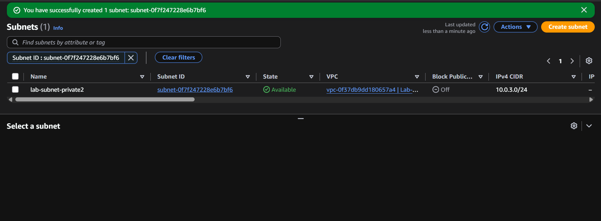
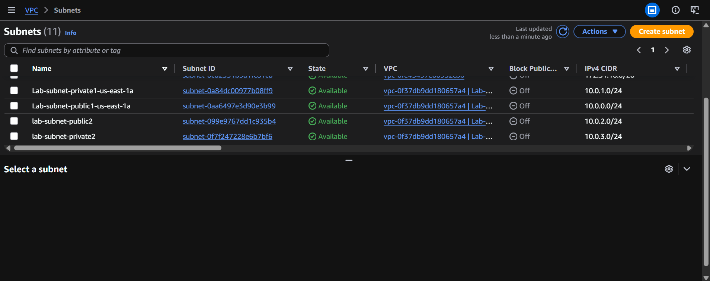
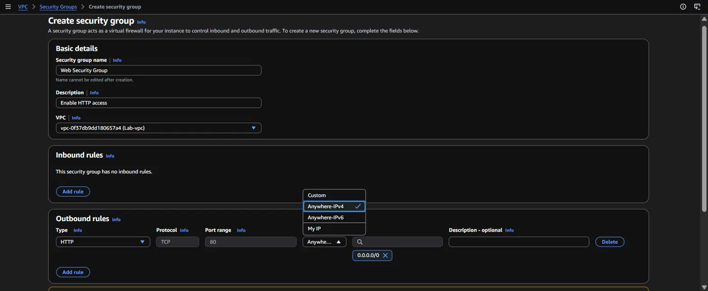
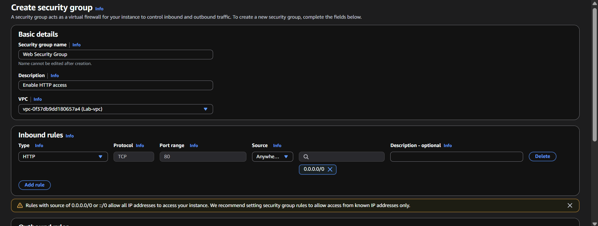
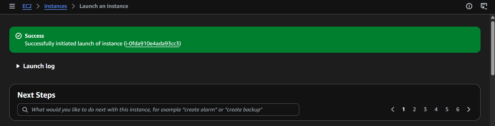

# Lab 2: Build a VPC and Launch a Web Server

Part of my AWS Academy Cloud Foundations coursework (Yoobee College, Diploma in Cloud Computing and Cyber Security).

## What this lab covers

This lab builds the network layer that everything else in AWS sits on top of. Rather than launching a server into a default network and hoping it works, I built the VPC myself - subnets split across two Availability Zones, an internet gateway for public traffic, a NAT gateway so private resources can reach out without being reachable themselves - then created a security group and launched an EC2 web server into the public subnet.

All resources were built in the `us-east-1` region.

## What I did

**1. Created the VPC and its supporting network resources**

A VPC is an isolated slice of the AWS cloud with its own private IP range. The console offers two paths: "VPC only", which creates just the empty network, or "VPC and more", which also builds the subnets, gateways and route tables in one workflow.

I used the "VPC and more" workflow so the supporting pieces were created and wired together in a single step. The success screen lists everything it built - the VPC itself, a public and a private subnet, an internet gateway attached to the VPC, a route table with a route to that gateway, plus an Elastic IP and a NAT gateway:

This left me with `Lab-vpc` and its first pair of subnets in `us-east-1a`:
- `Lab-subnet-public1-us-east-1a` - `10.0.0.0/24`
- `Lab-subnet-private1-us-east-1a` - `10.0.1.0/24`

**2. Added a second pair of subnets in a different Availability Zone**

One AZ is a single point of failure. To make the network capable of running across two, I manually added a second public and second private subnet in `us-east-1b`, continuing the same `/24` addressing pattern.

The public subnet, `lab-subnet-public2`, took `10.0.2.0/24`. Its details page confirms the important parts - it landed in the intended VPC, in `use1-az1` (us-east-1b), with 251 usable addresses:

Then the matching private subnet, `lab-subnet-private2`, on `10.0.3.0/24`:

With both pairs in place, the VPC has four subnets - a public and a private one in each of two Availability Zones - with no overlapping CIDR ranges:

**3. Created a security group to allow HTTP traffic**

A security group is a virtual firewall attached to an instance. It's stateful and deny-by-default: nothing gets in unless a rule explicitly allows it.

I created `Web Security Group` in `Lab-vpc` with a single rule allowing HTTP (TCP port 80) from anywhere. My first attempt added that rule in the wrong place - I put it under **Outbound rules**, leaving the security group with no inbound rules at all. As written, this would have let the server send traffic out on port 80 but blocked every incoming web request, so the site would have been unreachable:

Corrected, with HTTP / TCP / 80 from `0.0.0.0/0` sitting under **Inbound rules** where it belongs:

The console warns about the `0.0.0.0/0` source, and that warning is fair - it opens the port to every IP address on the internet. For a public web server that's the intended behaviour, since any visitor needs to reach port 80. For anything administrative, like SSH, it would be the wrong choice.

**4. Launched a web server instance into the public subnet**

Finally I launched an EC2 instance into `Lab-vpc`'s public subnet, attached to `Web Security Group`, so the network and firewall built in the previous steps were actually put to use:

## What I learned

- **A VPC is the foundation, not an afterthought.** Instances, databases and load balancers all live inside a VPC. Getting the address ranges and subnet layout right first is far easier than rearranging a network that already has resources running in it.
- **Public vs. private is about routing, not a checkbox.** A subnet is only "public" because its route table sends internet-bound traffic to an internet gateway. The private subnets use a NAT gateway instead, which lets resources make outbound connections (for updates, for example) while remaining unreachable from the internet.
- **Spreading subnets across Availability Zones is what makes a design resilient.** Each AZ is physically separate infrastructure. Building matching subnets in two AZs is what later allows workloads to survive one of them failing.
- **Inbound and outbound rules are not interchangeable.** Putting the HTTP rule in the outbound section left the group with no inbound rules, which would have silently blocked every visitor - the instance would have launched fine and simply not served anything. It's a good reminder that a misconfiguration doesn't always announce itself as an error.
- **Security groups are deny-by-default, like IAM.** The same principle from [Lab 1](../lab1-iam/README.md) shows up again at the network layer: nothing is permitted until a rule explicitly permits it.
