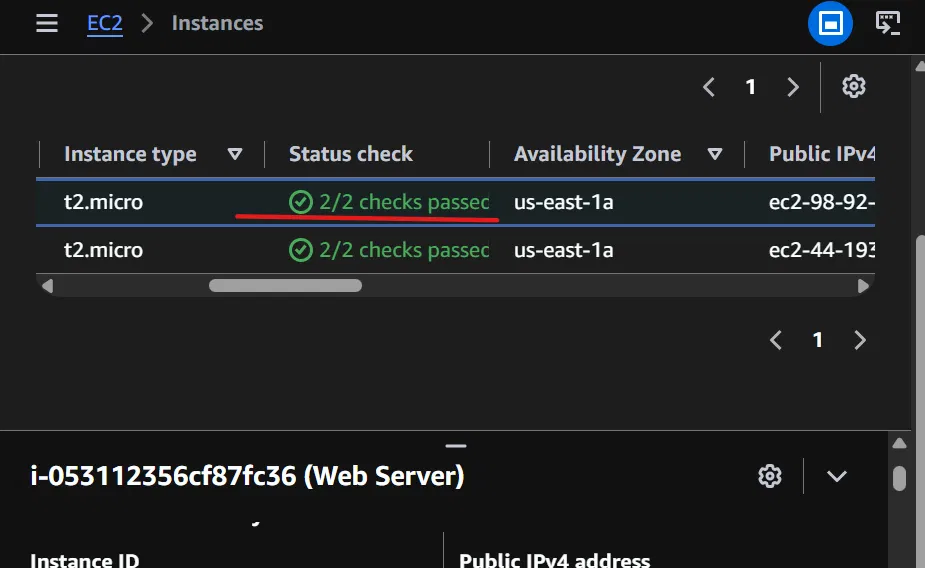
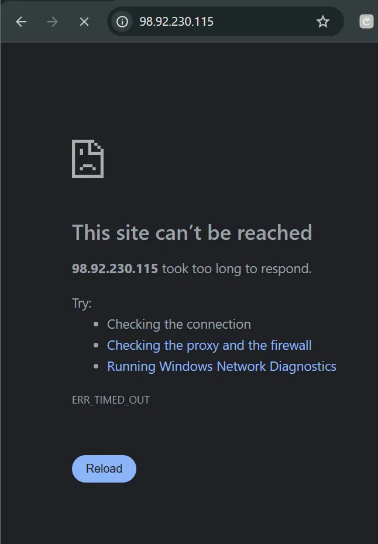
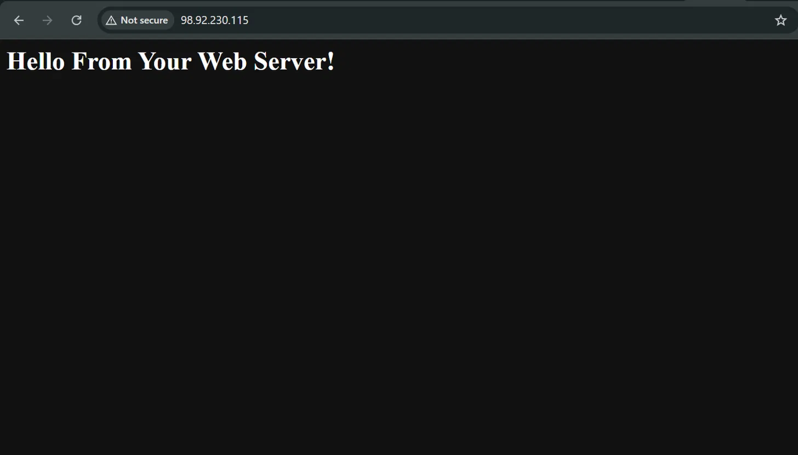
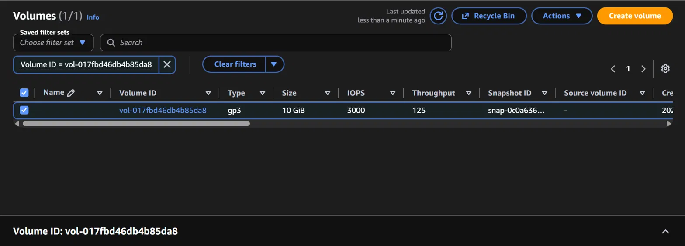
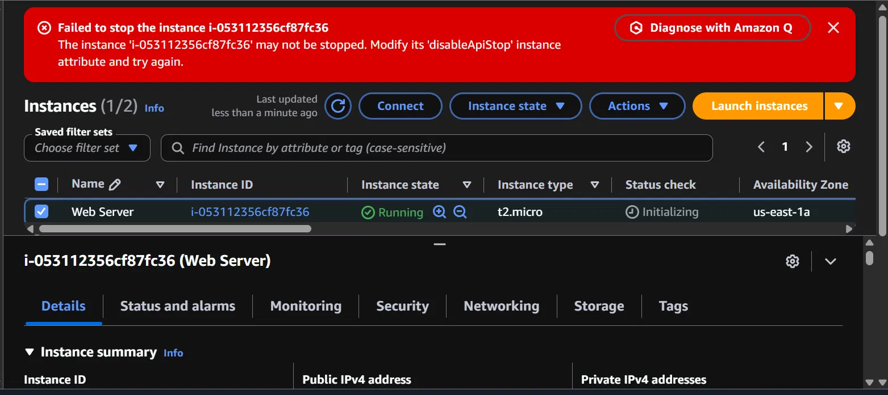

# Lab 3: Introduction to Amazon EC2

Hands-on lab launching an EC2 instance from scratch, configuring it to serve
a basic web page, and testing security group rules, resizing, and stop
protection.

## What I did

**Launch the instance** - Launched a t2.micro instance named "Web Server"
running Amazon Linux 2023, using the vockey key pair, placed in the Lab
VPC's public subnet. Created a new security group ("Web Server security
group") with no default inbound rules, so nothing could reach it yet.
Added a user data script that installs and starts Apache (httpd) and drops
a "Hello From Your Web Server!" index.html on first boot - meaning the
server is ready to serve a page the moment it launches, with zero manual
setup after that.

**Monitor** - Checked the Status checks tab (both system and instance
checks passed), the Monitoring tab (CloudWatch metrics, sparse since the
instance was freshly launched), and pulled the system log and an instance
screenshot from the Actions menu, useful ways to inspect a running instance
without connecting to it directly.

**Test the security group** - Copied the instance's public IPv4 address and
tried loading it in a browser. It failed to connect, timing out, even
though the server was already running and serving content. This is because
the security group I created had no inbound rules, so it was blocking every
request by default, including mine.

Added an inbound rule to the Web Server security group (Type: HTTP, Port
80, Source: Anywhere-IPv4) and refreshed the browser. The page loaded
immediately.

**Resize the instance** - Stopped the instance, changed its instance type
from t2.micro to t2.small, enabled stop protection, then resized the root
EBS volume from 8 GiB to 10 GiB using the Storage tab's Modify volume
option, and restarted it. Volume resizing on EBS can be done live without
recreating the volume.

**Check service quotas** - Looked at EC2's Service Quotas page, searching
for "running on-demand" limits, a reminder that AWS accounts have default
caps on how many resources you can run at once, adjustable by request.

**Test stop protection** - Tried stopping the instance again and got a
"Failed to stop the instance" error, since stop protection was still
enabled. This confirms the protection setting actually works, it's not
just a checkbox with no effect.

Disabled stop protection and successfully stopped the instance afterward.

## Key concepts

- Security groups: a firewall attached to an instance, deny-all by default,
  requiring explicit inbound rules to allow any traffic in
- User data script: code that runs automatically the first time an
  instance boots, used here to install and start a web server with no
  manual setup
- Stop protection: an instance-level safety switch that blocks accidental
  stops via the API or console until deliberately disabled
- EBS volume resize: root volumes can be resized live while attached,
  without needing to create a new volume or lose data
