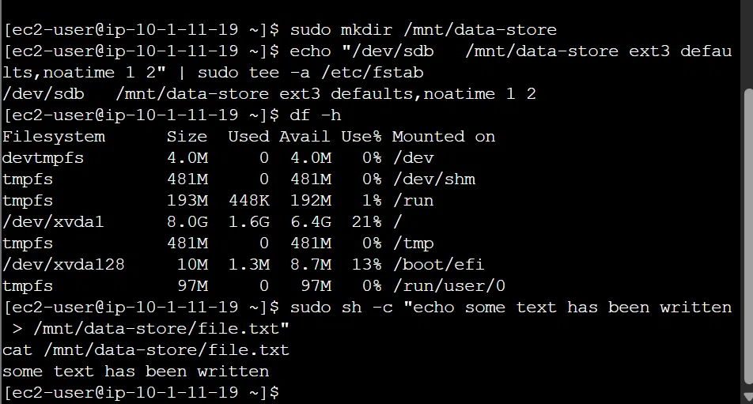
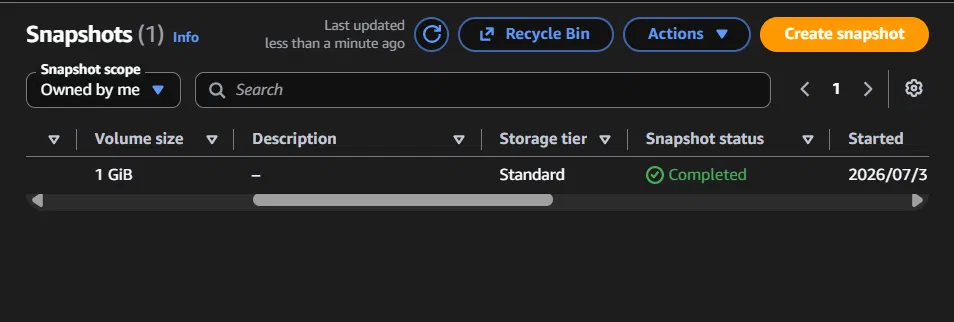
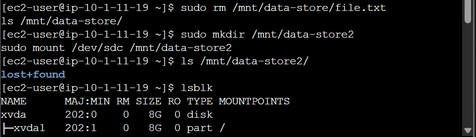

# Lab 4: Working with EBS

Hands-on lab creating an EBS volume, formatting and mounting it, backing it up 
with a snapshot, and restoring that snapshot to a new volume.

## What I did

**Create a volume** - Created a 1 GiB gp2 EBS volume in the same Availability 
Zone as my running EC2 instance, tagged "My Volume". A volume can only attach 
to an instance in the same AZ.

*(Screenshot pending: the volume showing as Available in the Volumes list.)*

**Attach and connect** - Attached the volume to the instance as `/dev/sdb`, 
then connected to the instance through Session Manager (browser-based terminal, 
no SSH key needed) and switched to the ec2-user account.

**Format and mount** - Formatted the new volume with an ext3 filesystem, 
created a mount point at `/mnt/data-store`, and added the mount to `/etc/fstab` 
so it persists across reboots. Wrote a test file to confirm it worked.

**Snapshot** - Created a snapshot of the volume (point-in-time backup stored 
in S3, only the used blocks get copied), then deleted the test file to set up 
a real test of the restore.

**Restore** - Created a new volume from the snapshot, attached it as `/dev/sdc`, 
and mounted it to verify the restore.

## What actually happened (troubleshooting)

The restore came back showing only an empty `lost+found` folder, no test file. 
I traced it back using `df -h` and `lsblk`: the original mount command for 
`/dev/sdb` never ran - I'd gone straight from writing the `fstab` entry to 
writing the test file. The `fstab` entry alone doesn't mount anything until a 
reboot, so the test file was written to the instance's root disk instead of 
the actual EBS volume. The snapshot, taken from the real (empty) volume, 
correctly reflected that - hence nothing came back on restore.

This didn't affect the volume, attach, snapshot, or restore mechanics - those 
all worked correctly. The gap was a missed step in my own command sequence, 
caught through `df -h` and `lsblk` output rather than assumption.

## Key concepts

- EBS volume: network-attached block storage, independent of the instance's 
  lifecycle
- Mounting: connecting a formatted volume to a filesystem path so the OS can 
  read/write to it - a volume can be attached but still not mounted
- Snapshot: incremental, point-in-time backup of a volume stored in S3
- `/etc/fstab`: config file for persistent mounts across reboots, doesn't 
  mount anything immediately on its own
