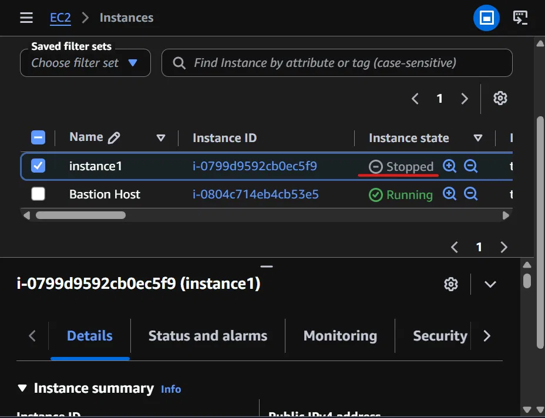

# Lab 5: Scheduled EC2 Stop with AWS Lambda

Hands-on activity building a Lambda function that automatically stops a 
running EC2 instance, triggered on a schedule by Amazon EventBridge.

## What I did

**Create the function** — Created a Lambda function called `myStopinator` 
using the Python 3.11 runtime. Lambda functions are code that AWS runs on 
demand, no server to provision or manage, and no cost while idle. Attached 
an existing IAM role (`myStopinatorRole`) so the function has permission to 
stop EC2 instances — without that role attached, the function would run but 
get denied the moment it tried to touch EC2, since AWS blocks all actions by 
default unless a permission explicitly allows them.

**Set the trigger** — Added an EventBridge rule (`everyMinute`) using a 
schedule expression, `rate(1 minute)`, so the function fires automatically 
every 60 seconds. This works similarly to a cron job on a Linux server, 
except there's no server running in the background waiting to fire it.

**Configure the code** — Added a Python script using boto3 (AWS's Python 
SDK) that stops a specific EC2 instance by ID. Filled in my actual region 
(`us-east-1`) and the instance ID for `instance1`, then deployed.

*(Screenshot pending: the function code deployed successfully in the Lambda console.)*

**Verify** — Checked the EC2 console after a minute and confirmed 
`instance1` had flipped to "Stopped" automatically, with no manual action 
on my end. Manually restarting the instance gets it stopped again within 
the next 60-second cycle, since the trigger keeps re-enforcing the 
stopped state on a loop.

## Key concepts

- Lambda function: on-demand code execution with no persistent server, 
  only runs (and only costs anything) when triggered
- IAM role: a permission set attached to a resource — without the right 
  role, the function is blocked by AWS's default-deny behavior
- EventBridge: AWS's scheduling/event service, used here as a recurring 
  trigger similar to a cron job
- boto3: AWS's official Python SDK, used to call AWS APIs from code
