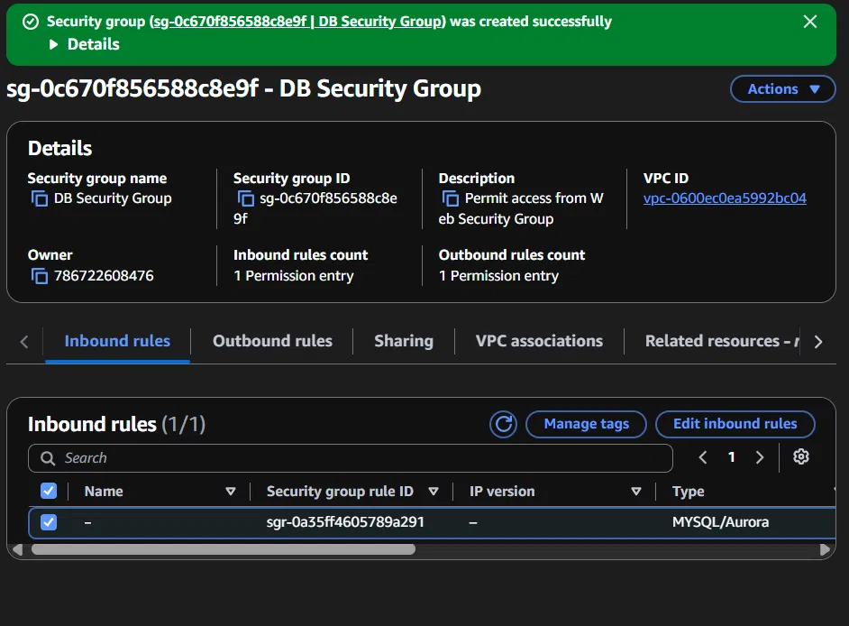
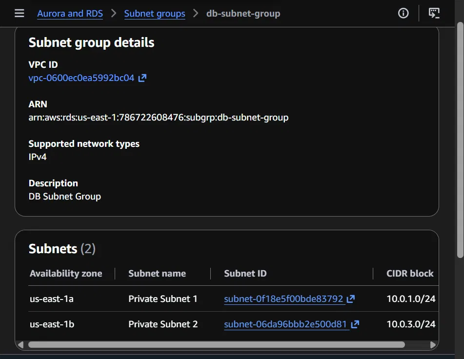
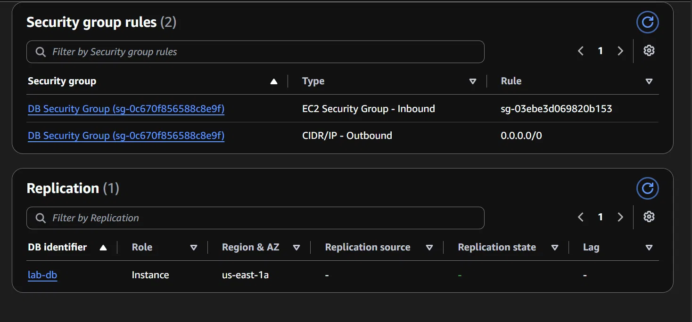

# Lab 5: Build Your DB Server and Interact With Your DB Using an App

## Objective
Launch a Multi-AZ Amazon RDS MySQL database, configure it to accept connections only from the existing web server, and connect a web application to interact with the database.

## Task 1: Create a Security Group for the RDS DB Instance
Created a new security group named "DB Security Group" in the Lab VPC. Added an inbound rule allowing MySQL/Aurora traffic (port 3306) with the source set to the Web Security Group, meaning only the EC2 web server is permitted to reach the database, not the wider internet.

## Task 2: Create a DB Subnet Group
Created a DB subnet group named "DB-Subnet-Group" spanning two Availability Zones (us-east-1a and us-east-1b), using subnets with CIDR blocks 10.0.1.0/24 and 10.0.3.0/24. This is required for Multi-AZ deployment, since RDS needs subnets in at least two AZs to place a standby replica.

## Task 3: Create an Amazon RDS DB Instance
Created a MySQL RDS instance named `lab-db` (initially auto-named `database-1` by the console, later renamed via Modify) with Multi-AZ deployment enabled, db.t3.micro instance class, and 20 GB General Purpose SSD (gp3) storage. Attached the DB Security Group and DB Subnet Group created in Tasks 1 and 2. Automatic backups and encryption were left unchecked to speed up lab deployment only, not standard practice for a production database.

## Task 4: Interact with the Database
Attempted to connect the web server's RDS front-end application to `lab-db` using the endpoint, database name `lab`, username `main`, and password. The form repeatedly returned to a blank state with no visible error message. Verified the security group rule was correctly attached and allowing the web server through, and re-entered credentials cleanly, but was unable to get the Address Book application to load within the lab session time available. No screenshot of a working app connection was captured for this task.

## Notes / Troubleshooting
- Initial database creation failed with an IAM Secrets Manager permission error, caused by leaving credentials management on the default Secrets Manager option. Resolved by switching to Self managed credentials.
- The instance was originally auto-named `database-1` rather than `lab-db` as specified in the task. Renamed via Modify > New DB instance identifier > Apply immediately.
- Task 4 connection issue was not resolved within the lab session. If revisited, next troubleshooting step would be checking the web server's PHP RDS connection script directly via SSH, or the browser's Network tab for the actual HTTP response on submit.
