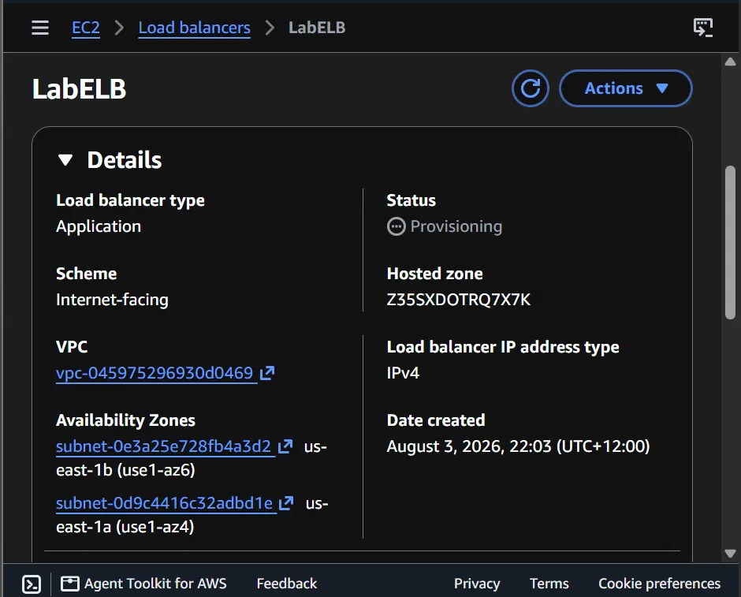
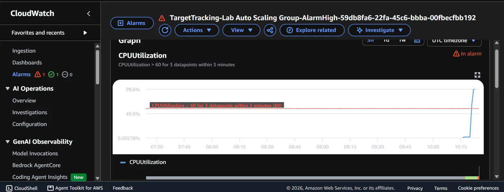
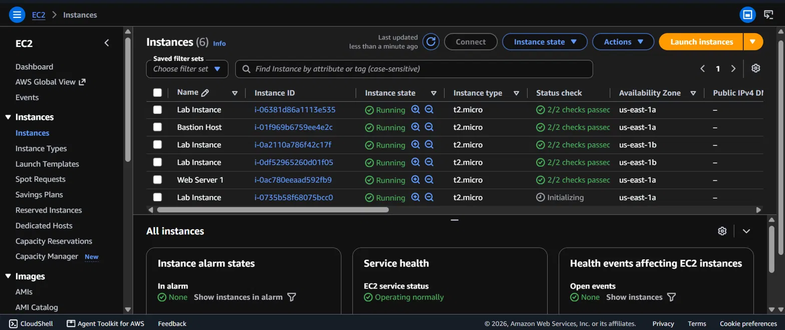

# Lab 6: Scale and Load Balance Your Architecture

Final lab of the course. Took an existing single web server and turned it
into a properly scalable setup: multiple identical web servers behind a
load balancer, automatically scaling out under load and back down when
demand drops. Scored 35/35.

## What I did

**Create an AMI** - Created an AMI (Amazon Machine Image) called
WebServerAMI from the running Web Server 1 instance. An AMI is a saved
image of an entire server, OS, software, files, all of it, so any new
servers launched from it are exact clones rather than blank machines
needing manual setup.

**Create a load balancer** - First created a target group (LabGroup), a
named list of servers that should receive traffic. Then created an
Application Load Balancer (LabELB), the type that reads request content
and routes based on it, ideal for HTTP/HTTPS. Placed it across both public
subnets since it needs to be internet-facing, attached the Web Security
Group, and set the HTTP:80 listener to forward to LabGroup.

**Create a launch template and Auto Scaling group** - Built a launch
template (LabConfig) using the WebServerAMI, t2.micro, vockey key pair, and
Web Security Group, essentially a blueprint for what any new server should
look like. Enabled detailed CloudWatch monitoring so scaling reacts faster
to changes.

Built the Auto Scaling group (Lab Auto Scaling Group) on top of that
template, placed in the two private subnets, attached to the LabGroup
target group, with minimum 2, desired 2, and maximum 6 instances. Set a
target tracking scaling policy aiming to keep average CPU utilization at
60% across the fleet, letting Auto Scaling add or remove servers on its
own to hit that target.

**Verify load balancing works** - Once the two initial Lab Instance
servers passed their health checks (meaning the load balancer confirmed
they were ready to receive traffic), grabbed the load balancer's DNS name
and loaded it in a browser. The app rendered successfully, proof the
request went through the load balancer and got routed to a real backend
server.

**Test Auto Scaling** - Used the app's built-in Load Test button to
artificially spike CPU load on the instances. Watched the CloudWatch
AlarmHigh alarm (CPUUtilization > 60% for 3 datapoints within 3 minutes)
flip from OK to "In alarm" as the CPU climbed toward 100%. This triggered
the exact chain covered in the module: CloudWatch alarm fires, Auto
Scaling launches new instances from the launch template, and the load
balancer registers and starts routing to them.

Confirmed in the EC2 console that extra Lab Instance servers had spun up
automatically in response, no manual action taken on my end.

**Terminate the original server** - Terminated Web Server 1 since its job
was done once the AMI was created and the Auto Scaling group had its own
running instances.

## Key concepts

- AMI: a saved image of a full server, used as the template for launching
  identical copies
- Target group: the load balancer's list of which servers should receive
  traffic
- Application Load Balancer: routes traffic based on request content,
  built for HTTP/HTTPS
- Launch template: the blueprint Auto Scaling uses when creating a new
  instance (AMI, instance type, security groups, etc.)
- Auto Scaling group: the manager that maintains a min/max/desired count
  of instances and adjusts it automatically
- Target tracking scaling policy: tells Auto Scaling to keep a metric
  (here, average CPU) near a target value by adding or removing capacity
- CloudWatch alarm: watches a metric and changes state when a threshold is
  breached, which can trigger an action like Auto Scaling
